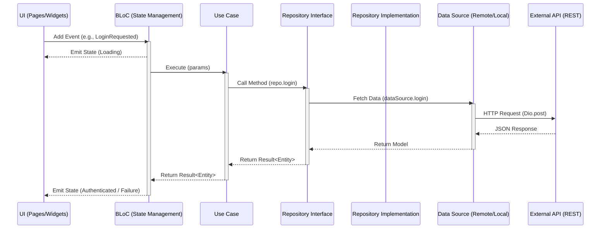

## Folder Structure

The project follows a **Feature-First Clean Architecture** approach, ensuring separation of concerns and scalability.

```
lib/
├── core/                # Global infrastructure (Independent of features)
│   ├── di/              # Main Service Locator (GetIt)
│   ├── error/           # Standardized Failures
│   ├── network/         # Centralized Dio Client & Network Logic
│   └── result/          # Freezed-based Result pattern (Success/Failure)
├── features/            # Feature modules (Domain-specific logic)
│   └── auth/            # Example: Auth Feature
│       ├── data/        # Data Layer (Infrastructure)
│       │   ├── datasources/  # API calls
│       │   ├── models/       # DTOs (Freezed + JSON Serializer)
│       │   └── repositories/ # Repository Implementations
│       ├── domain/      # Domain Layer (Pure Business Logic)
│       │   ├── entities/     # Pure Data Classes
│       │   ├── repositories/ # Repository Interfaces
│       │   └── usecases/     # Single-responsibility business actions
│       ├── presentation/# Presentation Layer (UI & State)
│       │   ├── bloc/         # Feature BLoC (Freezed states/events)
│       │   └── pages/        # Feature Screens
│       └── auth_di.dart # Feature-specific DI registration
├── app/                 # Global App Config & Shared Components
│   ├── core/            # App-level config
│   │   └── config/      # Routes (GoRouter) and Theme Logic
│   └── shared/          # Reusable UI & Logic across features
│       └── widgets/     # Atomic Design (Atoms, Molecules, Organisms)
└── main.dart            # Application Entry Point
```

## Architectural Layers

### 1. Domain Layer (Highest Level)
- **Entities**: Pure Dart objects representing business data. No dependencies on JSON or external libraries.
- **Repository Interfaces**: Abstract contracts defining data operations required by the business.
- **Use Cases**: Single business actions (e.g., `LoginUseCase`). They only depend on repository interfaces and return `Result<T>`.

### 2. Data Layer
- **Models (DTOs)**: Freezed classes used for JSON serialization. Includes mappers (`toEntity()`) to convert DTOs to Domain Entities.
- **Data Sources**: Handle raw data operations (e.g., calling Dio for REST APIs).
- **Repositories**: Implementations of the Domain repository interfaces. They orchestrate data flow between sources and map data to entities.

### 3. Presentation Layer
- **BLoC**: Manages feature state using Freezed union types for Events and States. BLoCs only interact with Use Cases.
- **Pages**: UI screens that consume BLoC states.

### 4. Core & App Layers
- **Core**: Contains infrastructure code that is agnostic to any specific business feature (e.g., how we handle network requests or DI).
- **App**: Handles app-level configuration like navigation and global themes, as well as shared components used by multiple features.

## Architecture Flow

The following diagram illustrates how data and events flow through the layers during a typical action:



### Layer Responsibilities

| Layer | Responsibility |
| :--- | :--- |
| **Presentation** | Captures input, triggers events, and renders state. |
| **BLoC** | Orchestrates state transitions. It knows **what** to do but not **how**. |
| **Domain (UC)** | Encapsulates a single business rule. |
| **Data (Repo)** | The single source of truth. Orchestrates data sources. |
| **Data (DS)** | Direct communication with APIs or Databases. |

## Dependency Injection (GetIt)

We use a modular DI approach:
1. Feature-specific registrations happen in `feature_name_di.dart`.
2. These are aggregated in `lib/core/di/service_locator.dart`.
3. The main entry point calls `sl.init()` before the app starts.

## Code Generation

This project uses `freezed` and `json_serializable` for data modeling and BLoC state management.

### Commands
- **Generate Code**: `make generate` (or `dart run build_runner build --delete-conflicting-outputs`)
- **Watch Changes**: `make watch` (or `dart run build_runner watch --delete-conflicting-outputs`)

## Key Packages
- `flutter_bloc`: State management.
- `freezed`: Immutable models and union types.
- `get_it`: Dependency injection.
- `dio`: HTTP client.
- `go_router`: Navigation.
- `easy_localization`: Multi-language support.
